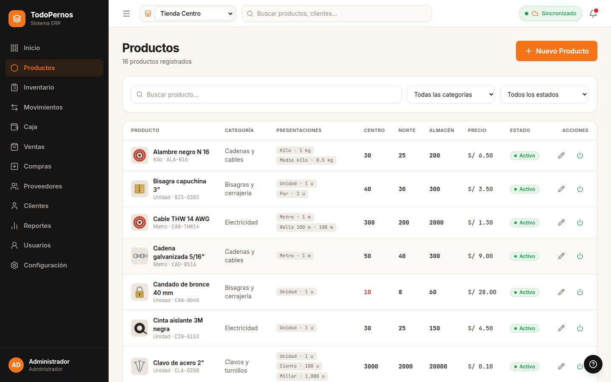

# TodoPernos · Frontend web

Frontend del sistema de gestión de una ferretería con 2 tiendas (cada una con su RUC) y 1 almacén compartido:
catálogo, inventario, traslados, caja, punto de venta con fiado, compras, reportes y administración.
Consume la API del repositorio [ferreteria-backend](https://github.com/juniorcueva-star/ferreteria-backend).



## Tecnologías

React 19 · TypeScript 6 (estricto) · Vite 8 · React Router 8 · TanStack Query 5 · Axios · Tailwind CSS 4 ·
React Hook Form + Zod 4 · lucide-react · Vitest + Testing Library · Playwright

## Inicio rápido

Requiere Node.js 22.12 o superior y el backend corriendo en `http://localhost:8080`.

```bash
npm install
npm run dev          # http://localhost:5173
```

La URL del backend se cambia con `VITE_API_URL` (ver `.env.example`). Guía completa para Windows:
[docs/COMO_EJECUTAR.md](docs/COMO_EJECUTAR.md).

## Comandos

| Comando | Qué hace |
|---------|----------|
| `npm run dev` | Servidor de desarrollo |
| `npm run build` | Compila TypeScript y genera la versión de producción en `dist/` |
| `npm run preview` | Sirve la versión de producción |
| `npm run lint` | ESLint |
| `npm test` | Pruebas unitarias y de componentes (Vitest) |
| `npm run e2e` | Pruebas de punta a punta con Playwright contra el backend real (requiere `.env.e2e`) |
| `npm run e2e:capturas` | Regenera las capturas de `docs/capturas` |

## Usuarios de demostración (backend con perfil `dev`)

| Usuario | Rol | Ubicación |
|---------|-----|-----------|
| `admin` | Administrador | Todas |
| `vendedor1` | Vendedor | Tienda Centro |
| `vendedor2` | Vendedor | Tienda Norte |
| `almacen1` | Almacenero | Almacén Central |

Las contraseñas son las de `ADMIN_PASSWORD` y `DEMO_PASSWORD` del `.env` del backend.

## Estructura

```
src/
├── api/          cliente HTTP, tipos de la API y endpoints
├── auth/         sesión, permisos por rol y rutas protegidas
├── componentes/  ui base, layout y formularios reutilizables
├── contexto/     ubicación de trabajo
├── hooks/        consultas reutilizables
├── logica/       cálculos puros: dinero, carrito, pagos, presentaciones
└── paginas/      una carpeta por módulo
e2e/              pruebas de Playwright
docs/             documentación y capturas
```

## Documentación

- [Cómo ejecutar (Windows + PowerShell)](docs/COMO_EJECUTAR.md)
- [Explicación del proyecto](docs/EXPLICACION.md)
- [Guía de diseño](docs/DISENO.md)
- [Decisiones](docs/DECISIONES.md)
- [Pendientes](docs/PENDIENTES.md)
- [Plan de trabajo](docs/PLAN.md)
- [Capturas de pantalla](docs/capturas)
